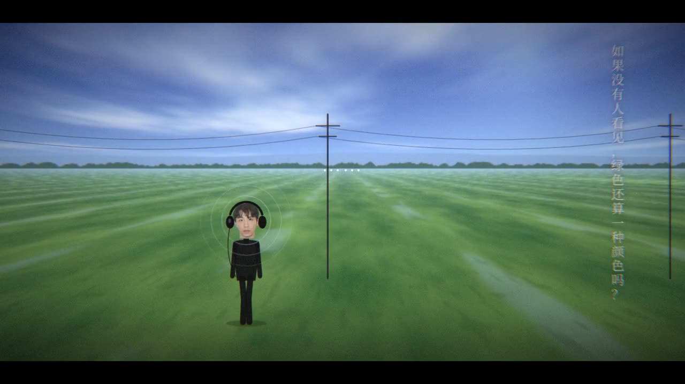
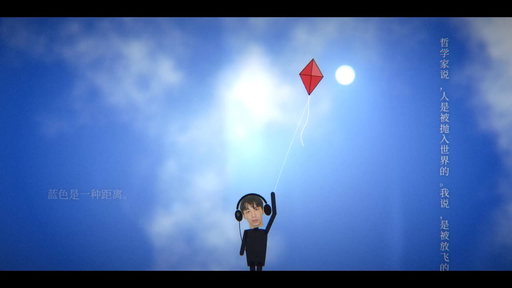
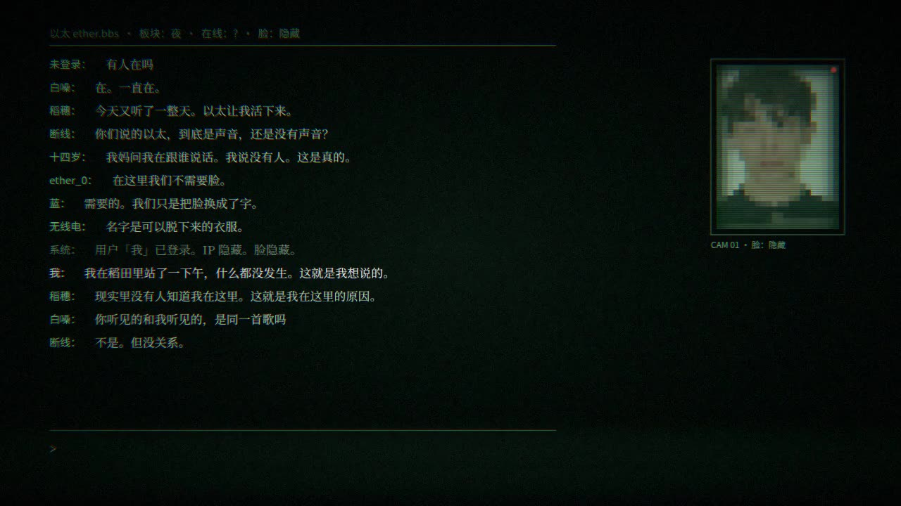
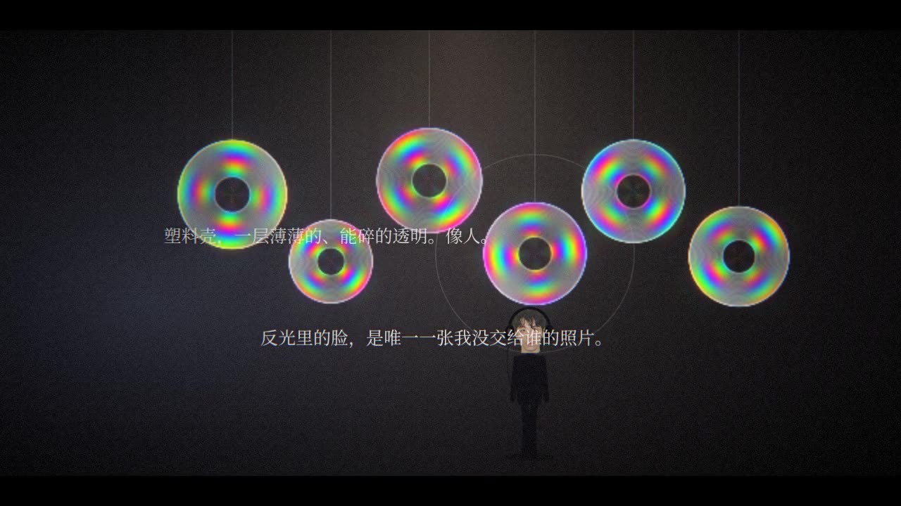
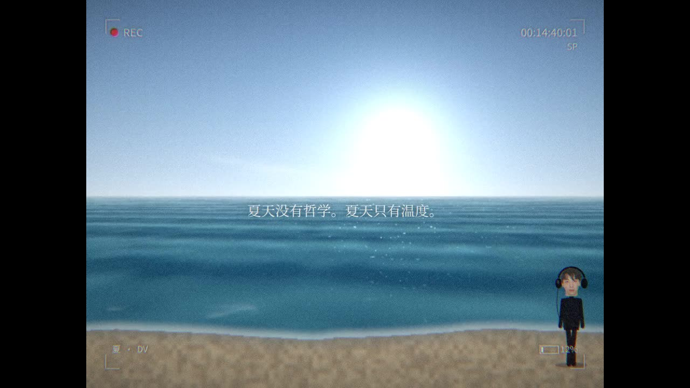
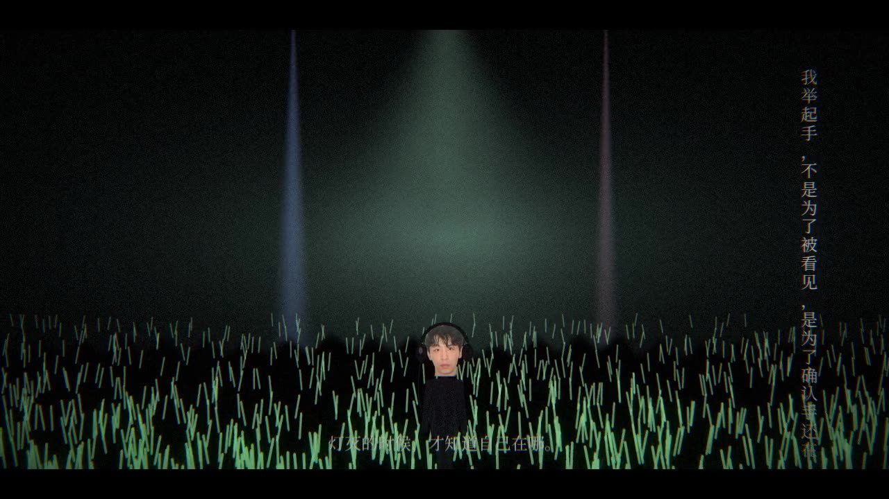
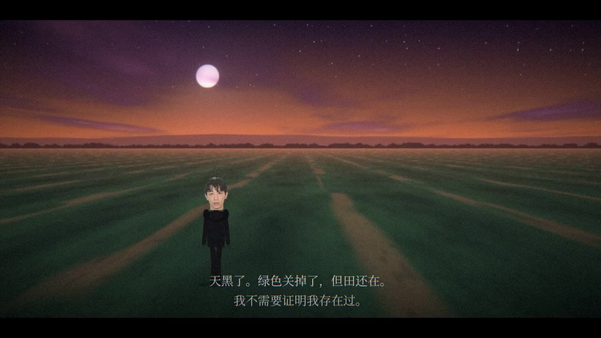
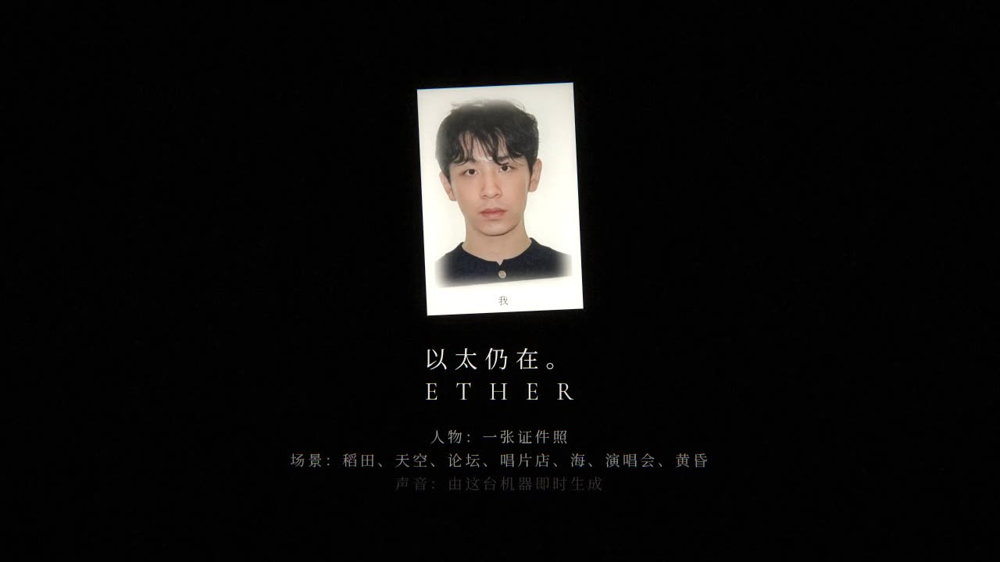

# 以太 · ETHER

**一场意识流。一张证件照，穿过 Lily Chou-Chou 式的风景。**
A stream-of-consciousness walking game, after the landscapes of *All About Lily Chou-Chou* (Shunji Iwai, 2001) — rice fields, a kite, a BBS in the dark, a record shop, a DV summer sea, a concert of green lights, dusk.

Everything on screen is generated in the browser: the scenes are GLSL, the soundtrack is Web Audio synthesis, the text is an original stream of thought. The only photograph is the ID photo that becomes the walker's head — the point of the piece.

> 证件照是国家看我的方式，不是我看我的方式。
> 在以太里没有人需要证件。

## 剧照 / Stills

Frames from the rendered run (1280×720, 3′57″). A compressed copy of the whole video is in [`video/ether-web.mp4`](video/ether-web.mp4) (20 MB); the full-quality master is what `tools/render.js` produces.

| | |
| --- | --- |
|  |  |
|  |  |
|  |  |
|  |  |

## 玩 / Play

Serve the folder over HTTP (WebGL2 textures need an origin) and open `index.html`:

```sh
cd ether && npx http-server -p 8080     # then http://127.0.0.1:8080
```

| 键 | 作用 |
| --- | --- |
| ← → / A D | 走 |
| 空格 | 聆听（稻田）· 取下光碟（唱片店）· 举起荧光棒（演唱会）· 摘下耳机（黄昏） |
| ↑ / W | 拉风筝线 |
| 打字 + Enter | 在以太 BBS 发一句话；Y / N 回答「你也听见了吗」 |
| 点击画面 | 左三分之一 = 走左，右三分之一 = 走右，中间 = 空格 |

The 「● 录制」 button records your own run (video + generated audio) to a `.webm` — your own stream-of-consciousness video.
`?auto=1` runs the piece by itself (attract mode).

## 章节 / Chapters

| | | |
| --- | --- | --- |
| I | 稻田 · The Field | 十四岁 — 戴着耳机站在田里，把世界关小 |
| II | 风筝 · Kite | 被一根线定义的自由 — 线会断 |
| III | 以太 · BBS | 没有脸的地方 — 脸：隐藏 |
| IV | 唱片店 · Disc | 被切成薄片的光 — 干涉色 |
| V | 海 · DV | 夏天没有哲学 — 4:3、REC、12% |
| VI | 演唱会 · Lights | 一万个人的孤独 — 灯会灭 |
| VII | 黄昏 · Return | 音量零 — 摘下耳机，只有风 |

## 视频 / Rendering the video

`tools/render.js` steps the autopilot deterministically frame by frame in headless Chromium, encodes the frames with ffmpeg, then renders the soundtrack offline from the same audio-event log so picture and sound stay in sync.

```sh
npm i playwright                     # browser automation (no browser download needed if you point --chrome at one)
node tools/render.js out/ether.mp4 --fps 30 --chrome /path/to/chrome --ffmpeg /path/to/ffmpeg
node tools/render.js --shots shots --plan "1:4,10;3:8,20" --dt 0.1   # QA stills
node tools/render.js --bench                                          # ms per frame per scene
```

Seeds change the order of thoughts and the placement of things: `?seed=42` / `--seed 42`.

## 结构 / Structure

```
ether/
├─ index.html          shell, fonts, recorder UI
├─ js/game.js          engine · scenes · avatar · thought stream · autopilot · render hooks
├─ js/shaders.js       GLSL: field(day/dusk), sky, bbs, discs, sea, concert · composite · bloom · film post
├─ js/audio.js         generative soundtrack (pads, wind, bells, waves, crowd) — live, recorded, or offline
├─ js/text.js          the stream of consciousness (original text)
├─ assets/             face.png (the ID photo, cut out) · portrait.png
└─ tools/render.js     headless frame-stepped mp4 renderer
```

The rendering pipeline is four passes: procedural scene (half-res on software GL, full-res on a GPU) → composite with the crisp 2D overlay → quarter-res bloom → film post (grain, chromatic aberration, vignette, CRT curvature for the BBS, DV chroma-subsampling for the sea, letterbox).

## 说明

This is an homage, not a port: no footage, music or text from the film is used. Scene names refer to the film's motifs; everything else is procedural or written for this piece.
